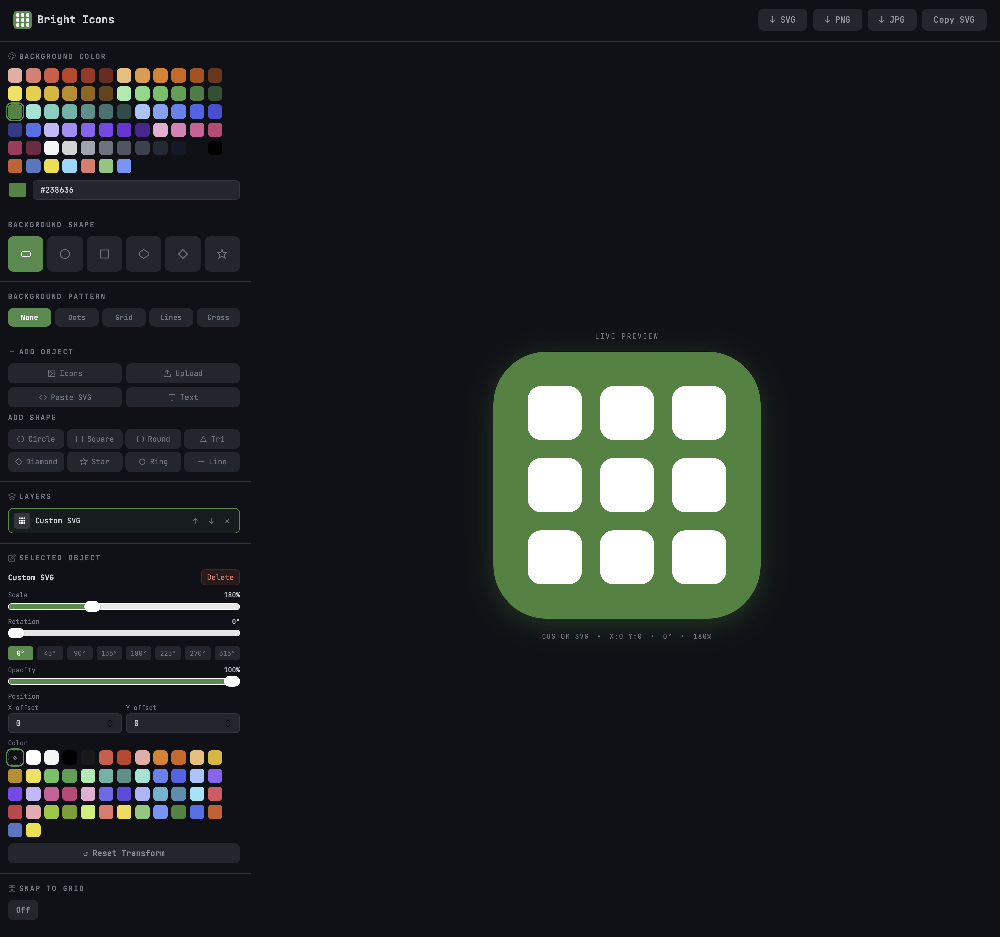

<h1 align="center">
  
   
  Bright Icons
</h1>

  Fast, minimal icon generator for modern interfaces.

  <a href="https://brighticons.netlify.app/">brighticons.netlify.app</a>

---

## What is Bright Icons?

**Bright Icons helps you generate simple, visually balanced icons for anything you need:**

- Web apps  
- Dashboards  
- Side projects  
- Open-source tools  
- Presentations  
- Marketing materials  
- Personal projects  

**`No sign-up. No cost. Just icons.`**

---

## How It Works

1. Choose a background color, shape, and pattern  
2. Select an icon, upload your own file, or paste raw SVG code  
3. Customize the icon color, size, and position freely  
4. Export as SVG, PNG, or JPG — or copy the SVG code instantly  

---

## Example

  

---

<h3 align="center">
To maintain consistency and compatibility, icon submissions aren’t accepted via pull requests. Requests for new icons are welcome through issues.
</h3>

---

  © 2026 Niko Marinović. All rights reserved.

