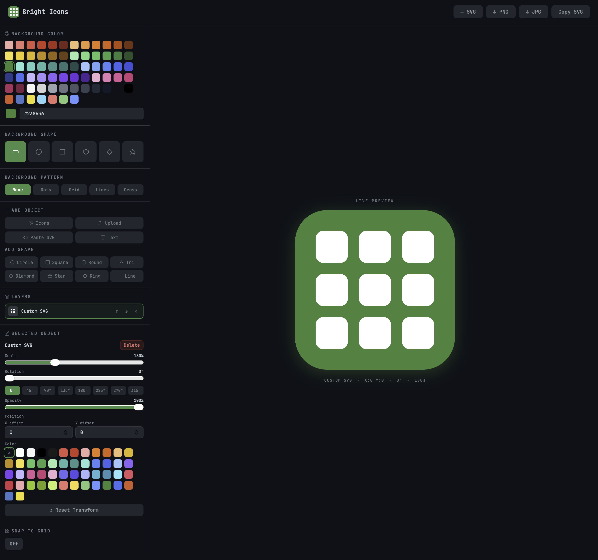
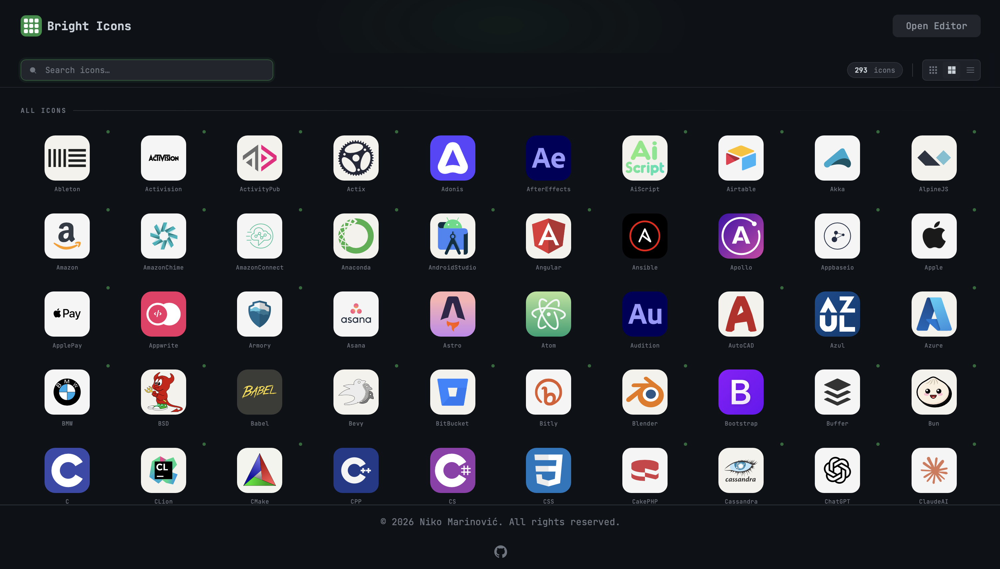

<h1 align="center">
  
  <br />
  Bright Icons
</h1>

<h4 align="center">
  Fast, minimal icon generator - use icons in your README too!
</h4>

<p align="center">
  <a href="https://brighticons.netlify.app/">brighticons.netlify.app</a>
</p>

---

## What is Bright Icons?

**Bright Icons helps you generate simple, visually balanced icons for anything you need:**

- Web apps  
- Dashboards  
- Side projects  
- Open-source tools  
- Presentations  
- Marketing materials  
- Personal projects  
- **GitHub READMEs** – embed your skills with dynamic SVG icons  

**`No sign-up. No cost. Just icons.`**

---

## How It Works

Creating your perfect icon is fast and intuitive:

1. **Pick your canvas** – choose a background color, shape, and pattern.  
2. **Add an icon** – select from our library, upload your own, or paste raw SVG code.  
3. **Customize freely** – adjust color, size, rotation, and position to get the look you want.  
4. **Export instantly** – download as **SVG**, **PNG**, or **JPG**, copy the SVG code, or embed icons in your **README** with a simple URL.  

> [!TIP]
> You can mix and match backgrounds, shapes, and icons to create completely unique visuals in seconds, including skill badges for your GitHub projects.

---

## Example

<p align="center">
  
</p>
<p align="center">
  
</p>

---

## Specifying Icons:

Copy and paste the code block below into your README to add your skills icons!

Change the `?i=aws,html,css` to a list of your skills separated by commas. You can find a full list of icons [here](https://brighticons.netlify.app/icons).

```md
[](https://brighticons.netlify.app)
```

[](https://brighticons.netlify.app)

---

## Themed Icons:

Some icons have dark and light versions. You can specify which theme you want using the theme URL parameter.
The default theme is light.

**Light Theme Example:**

```md
[](https://brighticons.netlify.app)
```
[](https://brighticons.netlify.app)

**Dark Theme Example:**

```md
[](https://brighticons.netlify.app)
```
[](https://brighticons.netlify.app)

---

## Custom Size:

Set the icon size with size (16–128px, default 48px):

```md
[](https://brighticons.netlify.app)
```

[](https://brighticons.netlify.app)


---

## Custom Spacing

Adjust the space between icons with spacing (0–64px, default 12px):

```md
[](https://brighticons.netlify.app)
```

[](https://brighticons.netlify.app)

---

## Icons Per Line

You can wrap icons into multiple rows using perline (default: all icons in one row):

```md
[](https://brighticons.netlify.app)
```

[](https://brighticons.netlify.app)

---

## Combining Parameters

You can combine theme, size, spacing, and perline together:

```md
[](https://brighticons.netlify.app)
```

[](https://brighticons.netlify.app)

---

## Centering Icons

To center the icons in your README, wrap them in a <p> with align="center":

```html
<p align="center">
  <a href="https://brighticons.netlify.app">
    
  </a>
</p>
```

<p align="center">
  <a href="https://brighticons.netlify.app">
    
  </a>
</p>

---

## Special Icons & Variants

Some icons have multiple variants, such as color schemes or monocolor versions. You can specify them using a colon after the icon name:

```html
<p align="center">
  <a href="https://brighticons.netlify.app">
    
    
  </a>
</p>
```

<p align="center">
    
    
</p>

---

## Parameters Reference

| Parameter | Description | Default |
|-----------|-------------|---------|
| `i`       | Comma-separated list of icons (e.g., `aws,html,css`) | — |
| `theme`   | Icon theme: `light` or `dark` | `light` |
| `size`    | Icon size in pixels (16–128) | `48` |
| `spacing` | Space between icons in pixels (0–64) | `12` |
| `perline` | Number of icons per row | All icons in a single row |

---

<h4 align="center">
Now you can mix and match all parameters to create fully customized icon badges for your GitHub README.
</h4>

<h3 align="center">
  Browse our <a href="https://brighticons.netlify.app/gallery">gallery</a> to find 400+ icons and all variants for your README!
</h3>

<hr />

<h3 align="center">
To maintain consistency and compatibility, icon submissions aren’t accepted via pull requests. Requests for new icons are welcome through issues.
</h3>

---

<p align="center">
  © 2026 Niko Marinović. All rights reserved.
</p>
